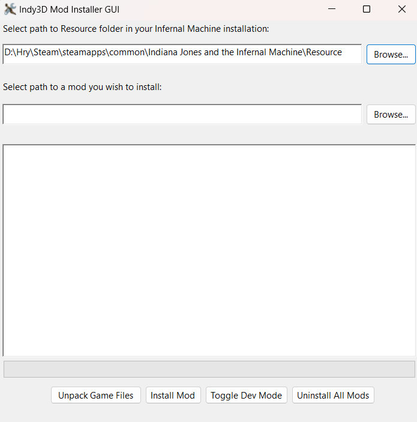

# Prerequisites

- .NET 8.0 runtime (if you don't have it already, you should get a pop-up when you open `Indy3DModInstaller.exe` that will offer to install it automatically).

# Usage

Extract anywhere and run `Indy3DModInstaller.exe`.

Common usage:

1. Unpack your game files by clicking on `Unpack`.
2. Install a mod by setting up a path to your mod by using the `Browse...` button and then clicking on `Install Mod`.
3. Enable Dev Mode for Indy3D.exe by clicking on `Toggle Dev Mode`.
4. Run the game by clicking on `Launch Game`.

