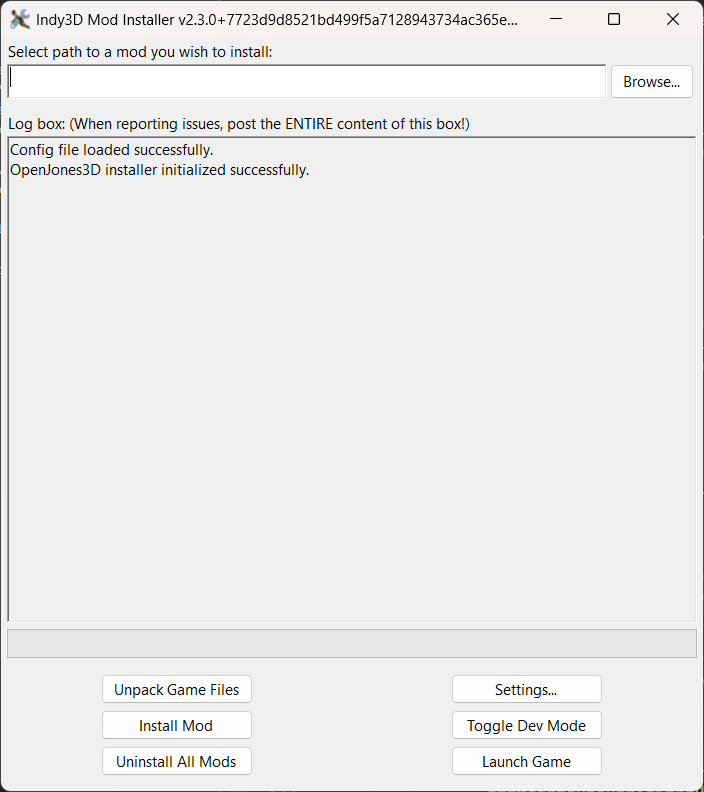
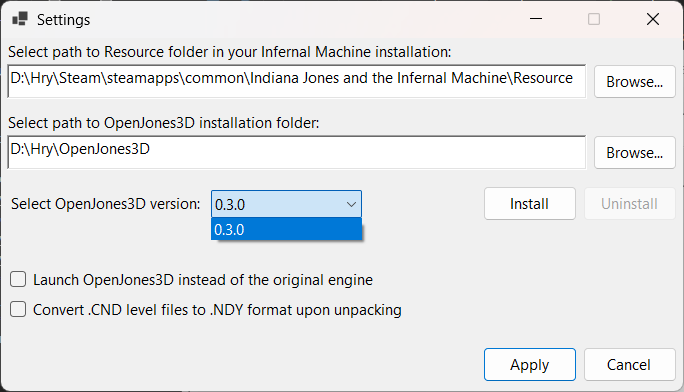

# Prerequisites

- .NET 10.0 runtime (if you don't have it already, you should get a pop-up when you open `Indy3DModInstaller.exe` that will offer to install it automatically).

# Documentation

Download the latest version on the [Releases](https://github.com/thekovic/Indy3DModInstaller/releases/latest) page. Extract the downloaded archive anywhere and run `Indy3DModInstaller.exe`.

### Main window:

1. Unpack game files from your game installation by clicking on `Unpack Game Files`.
2. To install a mod, use the `Browse...` button to set a path to your mod, and then click on `Install Mod`.
3. Uninstall all mods and reset your game installation to vanilla state by clicking on `Uninstall All Mods`.
4. Open the Settings window by clicking on `Settings...`. You can find more information about the Settings window [here](#settings-window).
5. Enable or disable Dev Mode for Indy3D.exe by clicking on `Toggle Dev Mode`.
6. Run the game by clicking on `Launch Game`.

### Settings window:

1. Indy3D Mod Installer attempts to detect your game installation from the game's entry in the Windows Registry. If this fails, or you want to change which game installation the app will modify, click the `Browse...` button next to the game installation text box and select the **Resource** folder in a different game installation.
2. Indy3D Mod Installer can download and install [OpenJones3D](https://github.com/smlu/OpenJones3D) for you. By default, it will install OpenJones3D into a folder called **OpenJones3D** located in the same folder as Indy3D Mod Installer. If you wish to change the OpenJones3D installation folder, click the `Browse...` next to the OpenJones3D folder text box and select a different folder.
3. Select an available OpenJones3D version using the dropdown menu. If it's not installed yet, click the `Install` button to install it. If it's already installed, you can click the `Uninstall` button to uninstall it.
4. Check the `Launch OpenJones3D instead of the original engine` checkbox to launch the version of OpenJones3D selected in the dropdown menu above when you press the `Launch Game` button in the main window.
5. Check the `Convert .CND level files to .NDY format upon unpacking` to do exactly that when you click the `Unpack Game Files` button in the main window. This is required if you wish to install any mods that modify the levels from the original campaign (including custom assets).
6. Click the `Apply` button to save your changes to the configuration file or click `Cancel` to discard them.

